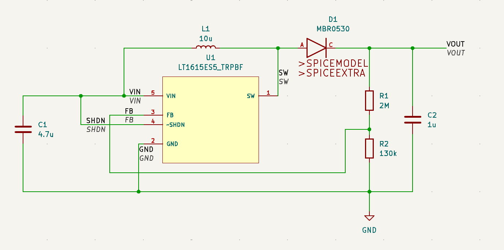
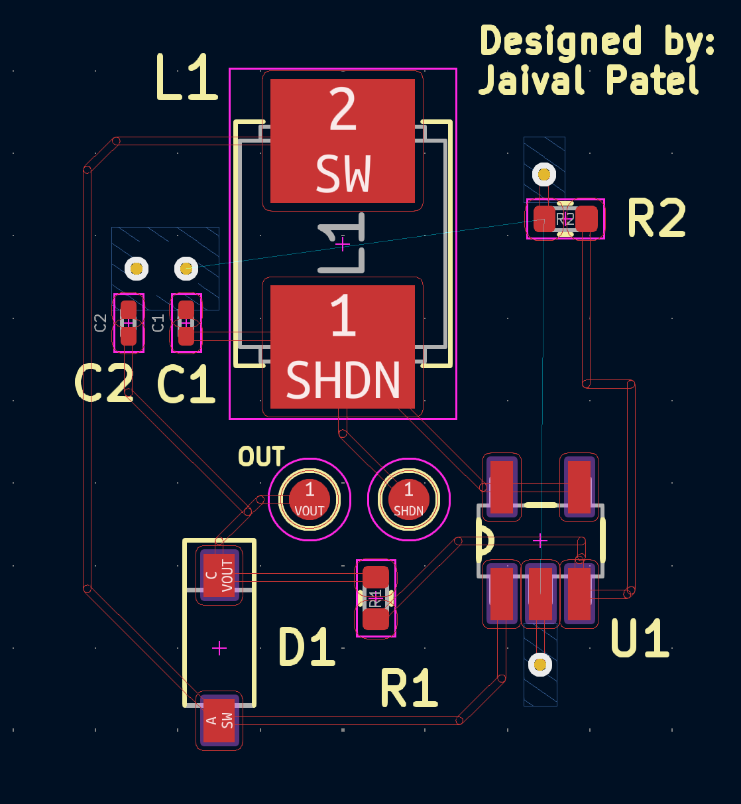
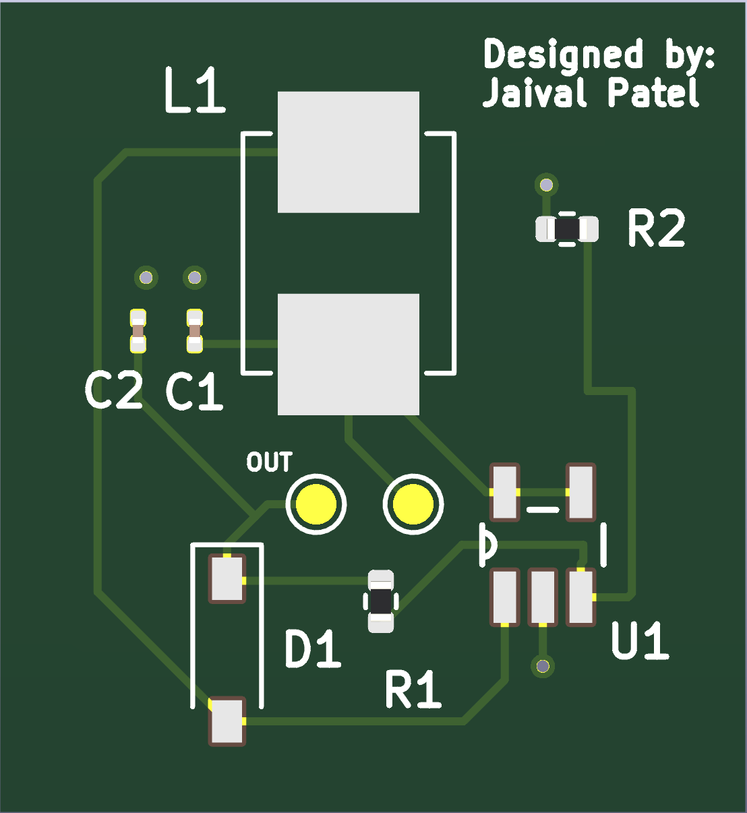

# LT1615 Boost Converter

LT1615 Boost Converter for 1-cell Lithium ion to 20V converter for LCD Bias. Schematic is based on datasheet. 

Software Used: **KiCad**

Now that I am writing this (and if you have noticed), routing to the vias that go straight to ground is unnecessary (right of the board) as the bottom plane is already grounded. 

I have added pads as test points for input voltage and to measure the output voltage (expected Voltage: 20 V, expected output Current: 12 mA).

This board serves as practice for routing and polygon pours similar to the XLM4015 board. It also served as good exercise to understand different ways to control power.

## Schematic Design

## Routing 

## Board

