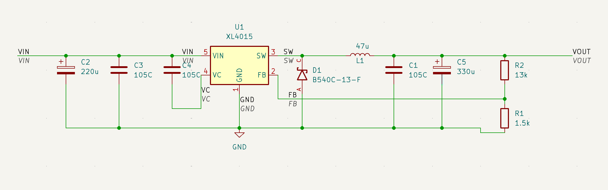
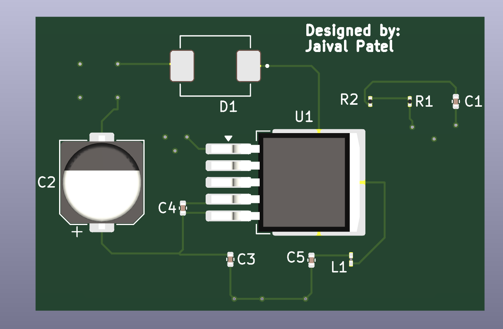

# XL4015 Breakout Board

XL4015 DC-DC Buck Inverter Breakout Board. Primarily made to practice routing and polygon pours, as well as expand my knowledge in the field of power electronics.

**Software used: KiCad**

There are certain polygon pours that are GND layers. Now that I’m writing this, maybe having the entire bottom layer be GND may be cleaner in design as well as easy to scale in terms of adding more components.

## Schematic

## Routing

## Board

